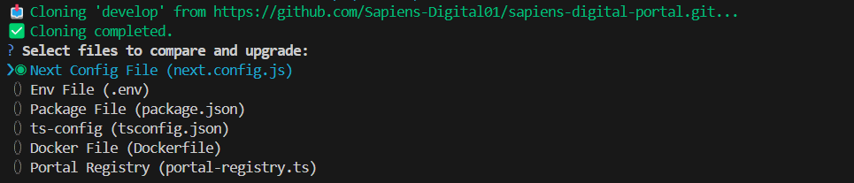

## Installation

Clone and install packages:

```bash
git clone https://github.com/Mohan719605/cli.git
cd cli
npm i
```
Install CLI globally
```bash
npm install -g .
```
## Usage
Open Terminal in your template or delivery repo

```bash
portal-upgrade upgrade --dev <dev_repo_path_or_git_url> '--files <config.json_file_path>', 'Path to JSON file (e.g., config.json) containing the file list for upgrade'
```
Usage with Branch Option

```bash
portal-upgrade upgrade --dev <dev_repo_path_or_git_url> --branch <branch_name>
```
Usage with Tag Option

```bash
portal-upgrade upgrade --dev <dev_repo_path_or_git_url> --tag <branch_name>
```
## ⚡️ Command Options 
### If you Know exact branch-name or tag-name to compare code files
| Option     | Description                                      | Example                                      |
|------------|--------------------------------------------------|----------------------------------------------|
| `--dev`    | **REQUIRED.** Path to dev repo or remote Git URL | `--dev ../dev-portal`                        |
| `--branch` | Branch to use (with git source only)             | `--branch feature/new-ui`                    |
| `--tag`    | Tag to checkout (with git source only)           | `--tag v2.1.0`                               |
| `--files`  | JSON filecontaining the file list for upgrade    | `--files config.json`   |

## Default Files Option
### If you haven't added --files option. CLI will show default files 

### After that You can select whatever portal u wanna update


## Example Command with Files Branch and Tag Options
```bash
portal-upgrade upgrade --dev https://github.com/Sapiens-Digital01/sapiens-digital-portal.git --branch ariaLabel-life
```
```bash
portal-upgrade upgrade --dev https://github.com/Sapiens-Digital01/sapiens-digital-portal.git --tag 0.1.2
```

## Example Command with Files tag
config.json file sample
```bash
{
  "upgradeFiles": [

    "next.config.js",
    "./apps/agent-portal/tsconfig.json",
    "./apps/agent-portal/package.json"

  ]
}
```

If local file
```bash
portal-upgrade upgrade --dev C:\sapiens-projects\sapiens-digital-portal --files config.json
```
If from remote-repo
```bash
portal-upgrade upgrade --dev https://github.com/Sapiens-Digital01/sapiens-digital-portal.git --files config.json
```


## If you want to change code and use it
Run in path of cli-task project
```bash
npx tsc
```
It will update your dist files accordingly and update CLI-TOOL globally
